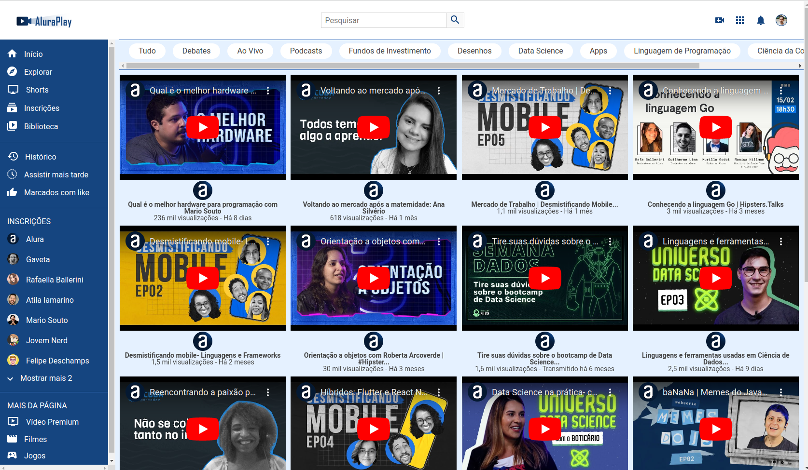
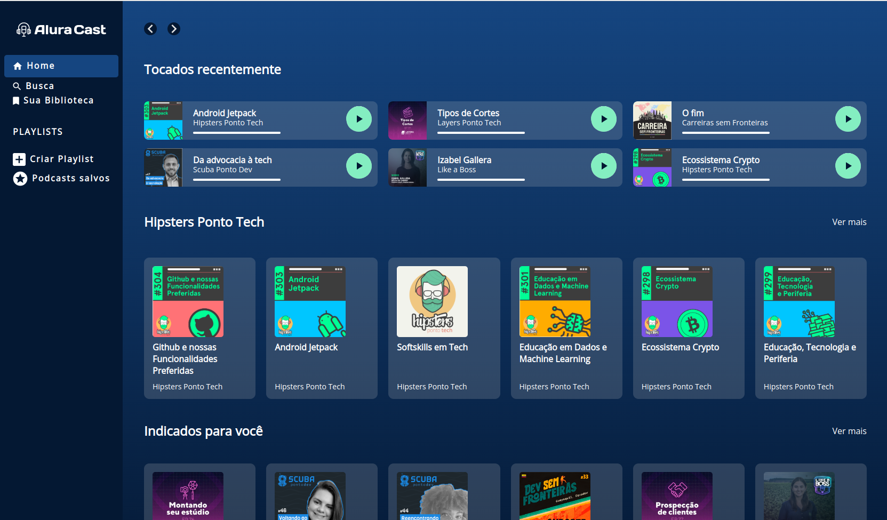
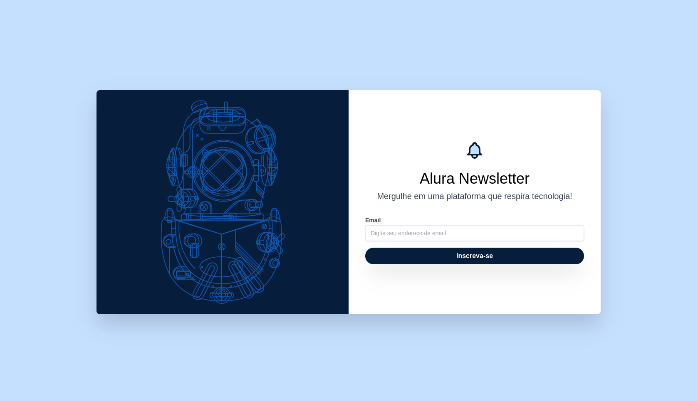
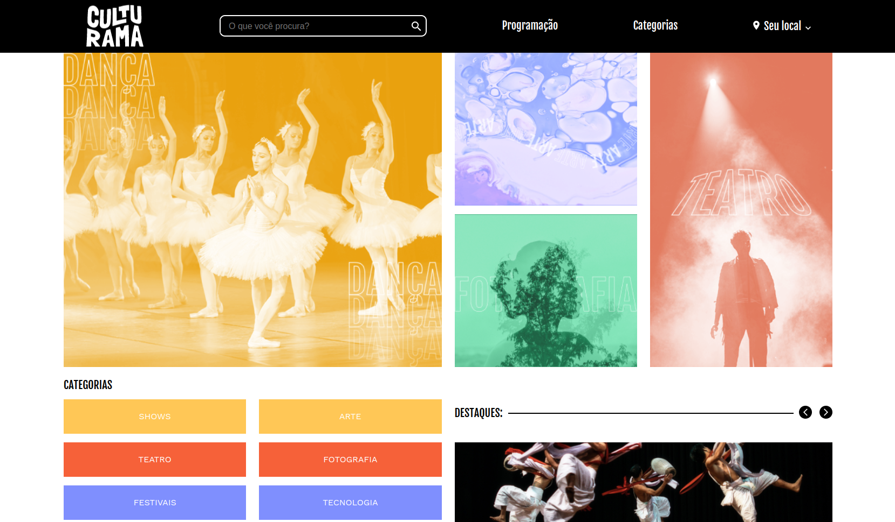

# CSS: estilos - Alura ⭐

"Com a diversidade de dispositivos (celulares, tablets, notebooks, smartTVs, etc.) utilizados para acessar aplicações atualmente, 
cada modelo apresenta um tamanho de tela diferente. O CSS apresenta soluções de layouts para essa nova realidade, com conceitos 
como Grid e Flexbox que permitem organizar elementos em uma página, facilitando a vida da pessoa desenvolvedora."

Diante desse contexto, neste projeto tive a oportunidade de aprofundar os conhecimentos e me especializar na construção de 
aplicações com design responsivo e estilizados com CSS.

Tive como base o curso da Alura, dividido em 5 partes. 

Os layouts das páginas podem ser visualizados a seguir.

## Layout

Alura Play          
:-------------------------:|
  |

Alura Cast           |         
:-------------------------:|
  |

Alura SPA           |        
:-------------------------:|
  |

Alura News           |        
:-------------------------:|
  |

Culturama           |        
:-------------------------:|
  |

## Link para Deploy

[Alura SPA](https://css-estilos-alura-ebsj.vercel.app/) 

[Alura News](https://css-estilos-alura-6hmf.vercel.app/) 

[Culturama](https://css-estilos-alura.vercel.app/) 

## Certificado

Certificado            |         
:-------------------------:|
  |

## Habilidades Desenvolvidas

 - Flexbox e Grid;
 - SASS;
 - Tailwind;
 - Abordagem mobile-first.

 
 ## Referências
[HTML Element Reference](https://www.w3schools.com/TAGS/default.asp) 
[CSS Reference](https://www.w3schools.com/cssref/index.php) 
[SASS](https://sass-lang.com/) 
[Tailwind](https://tailwindcss.com/) 
[CSS: estilos](https://cursos.alura.com.br/formacao-css-estilos) 
